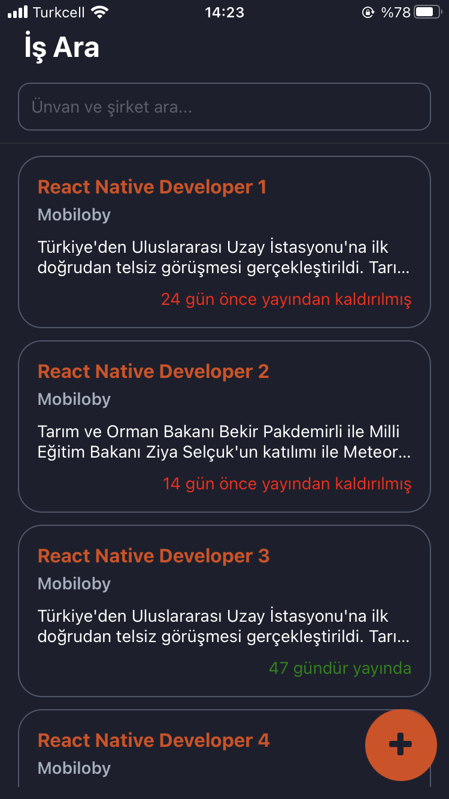
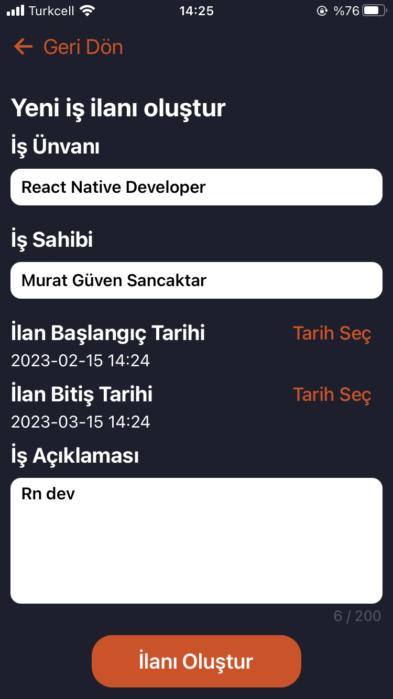

### Jobs-Crud App

### Built With:

- **React Native Expo**

### Getting Started:

- Clone the project: git clone https://github.com/mguvensncktr/jobs-crud.git
- run npm or yarn
- Open up the project on your physical device with Expo Go app or on your simulator

### Running the tests:

- To run the unit tests on the project type "yarn test" on your terminal.

### Screenshots:

<table>
  <tr>
    <td>Home Screen</td>
     <td>Home Screen 2</td>
     <td>Home Screen Empty Search Result</td>
  </tr>
  
  <tr>
    <td></td>
    <td></td>
    <td></td>
  </tr>
 </table>

<table>
  <tr>
    <td>Job Details Screen</td>
     <td>Job Details Screen 2</td>
     <td>Job Details Screen 3</td>
  </tr>
  
  <tr>
    <td></td>
    <td></td>
    <td></td>
  </tr>
 </table>
 
 <table>
  <tr>
    <td>Add New Job Screen</td>
     <td>Add New Job Screen 2</td>
     <td>Add New Job Screen 3</td>
  </tr>
  
  <tr>
    <td></td>
    <td></td>
    <td></td>
  </tr>
 </table>
